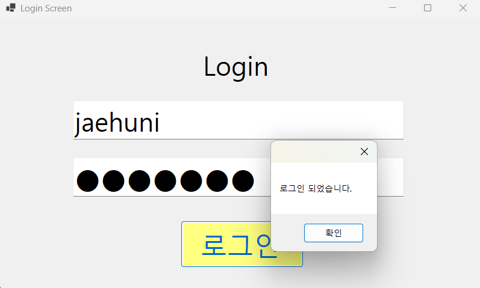
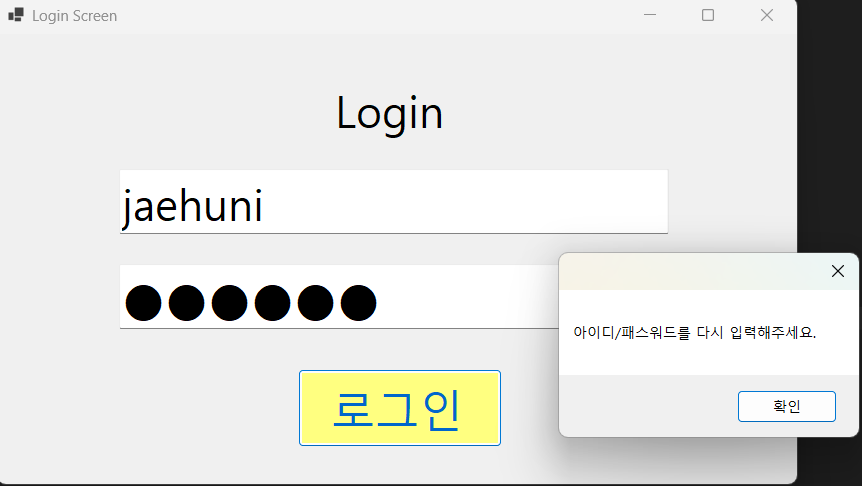
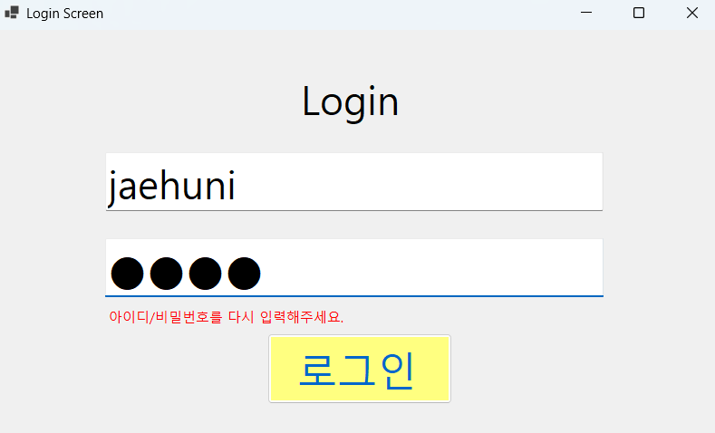

# (C# 코딩) 에코 메신저
## 개요
- C# 프로그래밍 학습
- 핵심기능: 패스워드 입력 내용을 숨기는 기능, Placeholder 기능, 탭을 이용한 입력 포커스 제어
- 화면구성: Label(Login), TextBox(아이디 / 패스워드), Button(로그인)
## 실행 화면 
- 1단계 코드의 실행 스크린샷

- 2단계 코드의 실행 스크린샷

## 배운 내용
	- 패스워드 입력 내용을 숨기는 기능 구현
	- Placeholder 기능 구현
	- 탭을 이용한 입력 포커스 제어
	- 엔터키를 이용한 입력 포커스 제어
	- 로그인 실패 메시지를 메시지 박스가 아닌 Label(lblMessage)에 보이도록 구현

# (C# 코딩) 로그인 스크린
## 개요
- C# 프로그래밍 학습
- 1줄 소개: 
	-사용자의 아이디와 패스워드를 입력받는 로그인 화면
- 사용한 플랫폼: C#, NET Windows Forms, Visual Studio, GitHub
- 사용한 컨트롤: 
	- Label, TextBox, Button
- 사용한 기술과 구현한 기능:
 - 과제1
	- Visual Studio를 이용하여 UI 디자인
	- 패스워드 입력 내용을 숨기는 기능 구현
	- Placeholder 기능 구현
	- 탭을 이용한 입력 포커스 제어
 - 과제2
 	- 엔터키를 이용한 입력 포커스 제어
	- 로그인 실패 메시지를 Label(lblMessage)에 보이도록 구현

## 실행 화면 (과제1)
- 과제1 코드의 실행 스크린샷

- 과제 내용
- Label(Login), TextBox(아이디 / 패스워드), Button(로그인)를 적절히 배치합니다.
- TextBox에 패스워드 입력 내용을 숨기는 기능을 구현합니다.
- TextBox에 Placeholder 기능을 구현합니다. (TextBox에 아무것도 입력되지 않았을 때, 회색으로 "아이디" "패스워드" 라는 텍스트가 보이도록 했습니다.)
- TextBox에 정해진 아이디와 패스워드를 입력했을 때, "로그인 되었습니다." 메시지를 띄우도록 했습니다.
- TextBox에 정해진 아이디와 패스워드를 입력하지 않았을 때, "아이디/패스워드를 다시 입력해주세요." 메시지를 띄우도록 했습니다.
- Tab(탭)을 눌렀을때 아이디와 패스워드 버튼 순서로 입력 포커스가 이동하도록 했습니다.

## 실행 화면 (과제2)
- 과제2 코드의 실행 스크린샷

- 과제 내용
	- label(lblMessage)을 추가하여 로그인 실패 메시지를 보여주도록 했습니다.
	- 과제1에서 구현한 기능에 추가적으로, 아이디 txtID에 입력후 엔터키를 누르면 패스워드 txtPW로 포커스가 이동하도록 했습니다.
	- 패스워드 txtPW에 입력후 엔터키를 누르면 로그인 버튼 btnLogin이 클릭되도록 했습니다.
	- 로그인 실패 시 메시지 박스보다는 로그인 실패 메시지가 Label(lblMessage)에 보이도록 했습니다.
